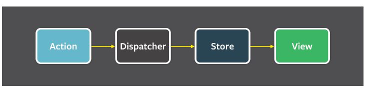

# Guide Redux

## C'est quoi Redux ?

Redux est une librairie Javascript créée par deux développeurs qui, en utilisant React, ont été confrontés a des problèmes de rendu ou re rendu d'informations qui sont sur plusieures pages. Ils souhaitaient pouvoir gérer un state global dans leur application et proprement. N'ayant pas trouvé chaussure à leur pied, ils ont carrément créé leur propre librairie en se basant sur Flux.

### Flux

Créé par facebook, Flux est une architecture permettant de gérer les données des applications. L'architecture est basée sur un principe simple, le flux de données est unidirectionnel. C'est ce que l'on appelle en architecture fonctionnelle le one-way data flow, le flux de données va toujours dans le même sens :

## Comment ça marche ?

### Explication

C'est assez simple, la boucle de la gestion de l'information ce déroule dans un ordre précis :

- La view déclenche une action. ( je veux ajouter une tache dans ma To Do liste )
- L'action fait l'appel à l'API, recupère les données qui seront utiliser, puis est envoyer au reducer avec useDispatch. ( ajoute par l'API la tache dans la base de donnée et va dans le reducer avec les données de la tache)
- Le reducer modifie le state selon l'action appelé ( il rajoute notre tache dans le state )
- La view est observeur du state avec useSelector, elle s'update automatiquement avec les changements de ceui-ci. ( on voit la tache rajouté à l'écran )

## Définitions

### Store

Un store contient l'ensemble de l'arbre d'état de votre application. La seule façon de modifier l'état à l'intérieur est d'envoyer une action sur celui-ci.

### State

Le state est un object JavaScript représentant l'état de l'application, il est en lecture seul, et sera par la suite pris en charge par le store.

### Action

Une action est un flux d'information que l'on souhaite envoyer à notre state.

### Reducer

Un reducer est une fonction pure JavaScript, prenant en paramètre un state et une action, et qui retourne le state après que l'action ait été effectuée.

### useSelector()

Le sélecteur est utilisé dans la view, il sera exécuté à chaque fois que le composant de la fonction sera rendu (à moins que sa référence n'ait pas changé depuis un rendu précédent du composant, de sorte qu'un résultat en cache puisse être renvoyé par le hook sans ré-exécuter le sélecteur). useSelector() s'abonnera également au Redux store, et exécutera votre sélecteur à chaque fois qu'une action sera distribuée (il est observer du state).

### useDispatch()

C'est une fonction comme useSelector importé de la librairie react-redux, elle permet d'envoyer une action au store Redux.
